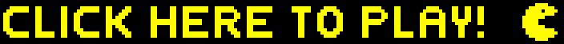

#  Pac-Man Client     &nbsp;&nbsp;&nbsp;&nbsp;&nbsp;&nbsp; 

This repository is the client SolidJS application for my solo Pac-Man project. Players can visit the live site and click play. Upon which the game will load with similar rules to the original Pac-Man where the player has to score as many points as they can while avoiding the ghosts that roam the board. This client connects to a backend server to display high scores made by other players on a leaderboard when all their lives run out and the game is over. The player can sign up and make an account themselves for their score to also be saved in the database.

The React version of this app (deployed version) can be found at https://github.com/jmcnally17/pacman-client-react

This app pairs with an API that has multiple versions: <br>
JS API (deployed version): https://github.com/jmcnally17/pacman-api-js <br>
Java API: https://github.com/jmcnally17/pacman-api-java

The original project monolith (with a full comprehensive commit history) can be found at https://github.com/jmcnally17/pacman-old

[](https://projectpacman.netlify.app)

### Technologies Used

- [SolidJS](https://www.solidjs.com/) as a web framework
- [Node.js](https://nodejs.org/en/) for the server runtime environment
- [HTML5 Canvas](https://www.w3schools.com/html/html5_canvas.asp) as a container for the graphics
- [Pexels Draw](https://apps.apple.com/us/app/pexels-draw/id1320744895?mt=12) for creating the boundary images and ghost sprites
- [GitHub](https://github.com/) for version control

A huge thank you to [Chris Courses](https://www.youtube.com/c/ChrisCourses) YouTube channel for his tutorial which helped with some of the basic game mechanics. Link to the tutorial video can be found [here](https://youtu.be/5IMXpp3rohQ).

Another thank you to [Stuart McNally](https://github.com/Stew2134) for remastering all the audio using [Ableton Live 11](https://www.ableton.com/en/live/).

## Usage

Those templates dependencies are maintained via [pnpm](https://pnpm.io) via `pnpm up -Lri`.

This is the reason you see a `pnpm-lock.yaml`. That being said, any package manager will work. This file can be safely be removed once you clone a template.

```bash
$ npm install # or pnpm install or yarn install
```

### Learn more on the [Solid Website](https://solidjs.com) and come chat with us on our [Discord](https://discord.com/invite/solidjs)

## Available Scripts

In the project directory, you can run:

### `npm run dev` or `npm start`

Runs the app in the development mode.<br>
Open [http://localhost:3000](http://localhost:3000) to view it in the browser.

The page will reload if you make edits.<br>

### `npm run build`

Builds the app for production to the `dist` folder.<br>
It correctly bundles Solid in production mode and optimizes the build for the best performance.

The build is minified and the filenames include the hashes.<br>
Your app is ready to be deployed!

## Deployment

You can deploy the `dist` folder to any static host provider (netlify, surge, now, etc.)
